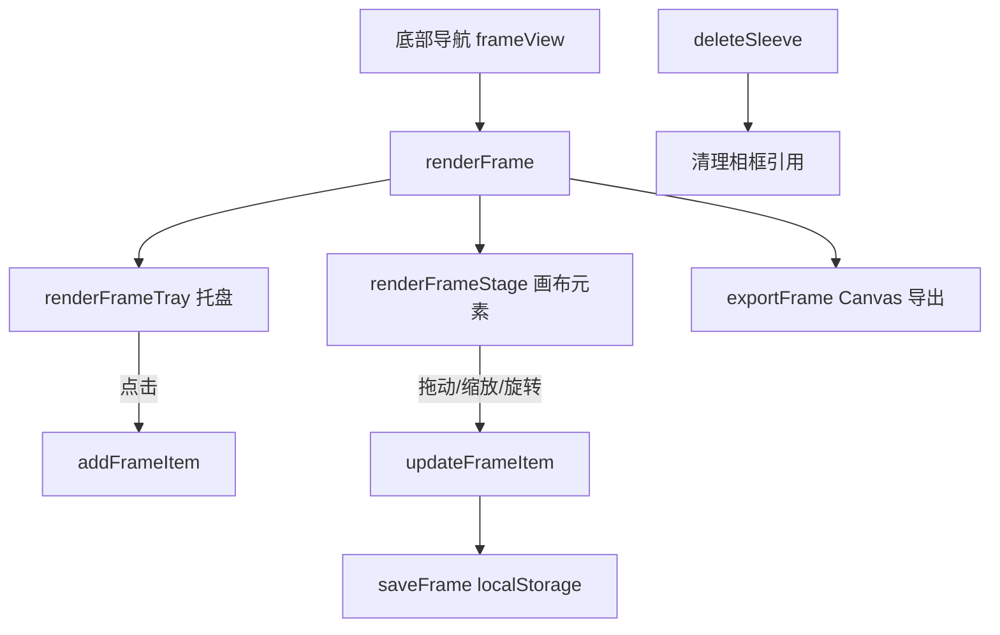

# 杯套相框（cup-sleeve-frame）

Feature Name: cup-sleeve-frame
Updated: 2026-09-14

## Description

在纯前端「杯套收藏馆」中移除贡献榜，新增相框功能。相框页面提供固定 4:3 的编辑画布与已上传杯套托盘，用户可点击托盘将杯套加入画布，并拖动、缩放、旋转摆放；布局保存于 localStorage，可导出为 PNG。

## Architecture



复用现有单页结构：`index.html` 定义视图，`app.js` 维护 `state.frame` 并渲染，`styles.css` 提供样式。

## Components and Interfaces

- `renderFrame()`：渲染托盘与画布，绑定指针事件。
- `renderFrameTray()`：列出 `state.sleeves` 中带图片的杯套。
- `addFrameItem(sleeveId)`：向画布新增元素，居中偏置摆放。
- `onFrameItemPointerDown(event)`：区分移动与控制柄操作。
- `startFrameMove` / `startFrameTransform`：基于 `pointermove`/`pointerup` 更新元素。
- `removeFrameItem(id)` / `clearFrame()`：移除元素。
- `exportFrame()`：按导出分辨率重绘到 `canvas` 并下载。
- `saveFrame()`：写入 `localStorage`。

## Data Models

`state.frame`：

```json
{
  "items": [
    { "id": "frame-...", "sleeveId": "custom-...", "x": 50, "y": 50, "scale": 1, "rot": 0, "z": 1 }
  ]
}
```

- `x` / `y`：元素中心相对画布的百分比（0-100）。
- `scale`：相对基础尺寸的倍数（0.25-4）。
- `rot`：旋转角度（度）。
- `z`：层级顺序。

存储键：`cup-sleeve-frame-v1`。

## Correctness Properties

- 画布元素中心始终位于 `[0,100] x [0,100]`。
- 某杯套被删除后，相框中不存在其 `sleeveId` 的元素。
- 导出图片的元素顺序与 `z` 升序一致。

## Error Handling

- 相框为空时导出：提示「相框还是空的」，不生成文件。
- 图片加载失败：导出捕获异常并提示「导出失败，请重试」。
- `localStorage` 不可用：沿用现有 `load`/`save` 的容错策略。

## Test Strategy

- 使用 jsdom 加载 `index.html` 与 `app.js`，验证：
  - 不存在贡献榜页面与导航。
  - 点击托盘元素后 `state.frame.items` 增加。
  - 删除杯套后相框引用被清理。
  - 清空相框后 `items` 为空。
- 画布拖拽、缩放、旋转与 PNG 导出在真实浏览器手动验证。

## References

[^1]: (index.html#L41) - 原贡献榜视图
[^2]: (app.js#L68) - 原 `renderRanking` 实现
